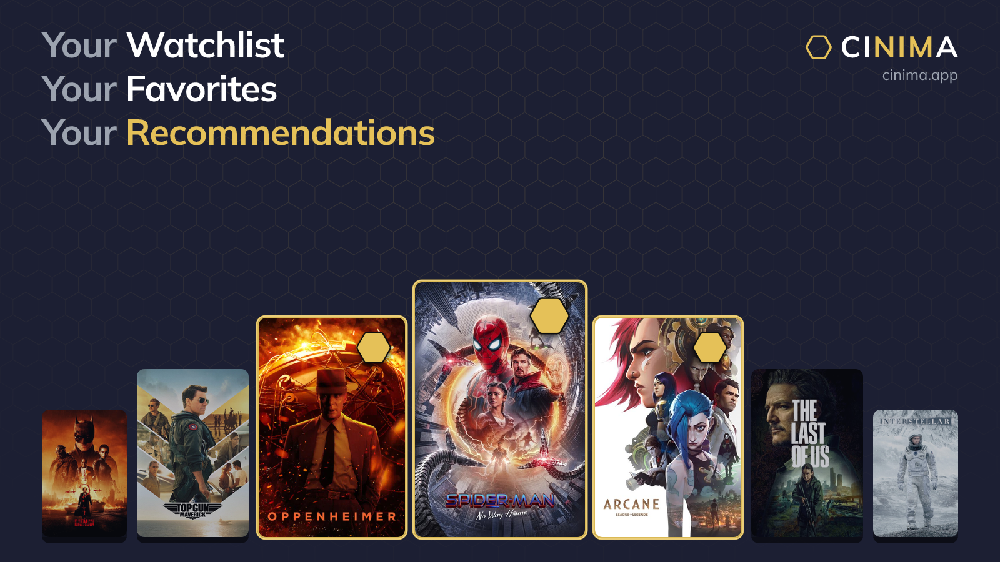

# Cinima



Social taste discovery for movies and TV. A [Nimiq Pay](https://nimpay.app/) Mini App.

Favorite titles you love, Recommend the ones that stand out, and find what to watch through taste overlap with people like you.

**[Open in Nimiq Pay](https://nimpay.app/miniapps/open/cinima.app)** · **[cinima.app](https://cinima.app)**

Your wallet is the account. Catalog names, posters, synopses, and ratings come from [TMDB](https://www.themoviedb.org/) and are cached by the API. The client never calls TMDB. Cinima does not charge NIM for catalog data.

This application uses TMDB and the TMDB APIs but is not endorsed, certified, or otherwise approved by TMDB.

## Use it

The signed-in app runs inside Nimiq Pay. Landing, Public Profiles, and Title Share pages are public on the web.

- HTTPS: [https://nimpay.app/miniapps/open/cinima.app](https://nimpay.app/miniapps/open/cinima.app)
- Custom scheme: `nimiqpay://miniapp?url=cinima.app`
- Site: [https://cinima.app](https://cinima.app)

Integration follows [nimiq.dev/mini-apps](https://nimiq.dev/mini-apps): `init()` → `listAccounts()` → `sign()` for a wallet session.

## What it does

- **Favorites** are public taste marks. After you Favorite at least three titles, Discover switches to taste overlap.
- **Recommends** are a gold-star upgrade on a Favorite (at most six movies and six TV shows).
- **Watchlist** (My List in the app) is a private save-for-later queue.
- **Thanks** are a directed signal that someone's Favorite was useful. Comments and Thanks are free.
- **Handles** make shareable URLs. Public Profile is `/:handle`. Title Share is `/:handle/t/{movie|tv}/{tmdbId}`.

In-app TMDB attribution lives on Me → Sources & terms.

## Layout

```
apps/web         Vue 3, Vite, Vue Router, Pinia, @nimiq/mini-app-sdk
apps/api         Hono, Drizzle, LibSQL/SQLite (public API on :8787; Studio on :8788)
packages/shared  Title IDs, Pay links, DTOs
```

Node 20+ and [pnpm](https://pnpm.io/) 9.15.0.

## Local development

```bash
cp .env.example .env
cp apps/web/.env.example apps/web/.env
pnpm install
pnpm --filter @cinima/shared build
pnpm dev
```

- Web: [http://localhost:5174/?demo=1](http://localhost:5174/?demo=1)
- API: [http://localhost:8787/health](http://localhost:8787/health)
- Studio: [http://localhost:8788/health](http://localhost:8788/health) (Creator-gated reads; local `pnpm dev` binds this in-process)

`DEMO_MODE` / `VITE_DEMO_MODE` is for local desktop only (`?demo=1`). Do not use demo auth inside Pay; Pay injects the wallet.

Vite binds `0.0.0.0`. To try the app from Pay on a phone, paste your machine's LAN URL for the Vite app. Leave `?demo=1` off.

```bash
pnpm test
pnpm typecheck
```

### Demo path

1. Open `/?demo=1`.
2. Favorite at least three titles on Discover.
3. Discover refreshes with overlap suggestions.
4. Open a TV title for ratings and the episode heat-map.
5. Post a comment.
6. On Me, set a Handle, then open `/:handle` or share a title.

## Environment

Root `.env` is read by the API. `apps/web/.env` is read by Vite.

| Variable | Where | Purpose |
| --- | --- | --- |
| `TMDB_API_KEY` | API | Live search, detail, and ratings sync. Optional; a seed catalog works without it. |
| `DATABASE_URL` | API | Local file SQLite, or a remote LibSQL URL. |
| `DATABASE_AUTH_TOKEN` | API | Remote LibSQL only. |
| `SESSION_SECRET` | API | Signs the wallet session. Change this before any shared deploy. |
| `DEMO_MODE` | API | Local demo auth. Keep `false` in production. |
| `WEB_ORIGIN` | API | Public site origin (CORS, share links, Pay intents). Production is `https://cinima.app` (no www). |
| `NIMIQ_RPC_URL` | API | Nimiq RPC for signature checks. |
| `VITE_SITE_ORIGIN` | Web | Public site origin used by the client. Production is `https://cinima.app`. |
| `VITE_API_BASE` | Web | API origin. Empty in local dev (Vite proxies `/api` and `/api/studio`). |
| `VITE_DEMO_MODE` | Web | Must match API demo auth for `?demo=1`. |
| `STUDIO_PORT` | API | Studio listen port. Default `8788`. |
| `STUDIO_INLINE` | API | Local `pnpm dev` binds Studio in-process unless `0`. Docker API sets `0`. |
| `STUDIO_UPSTREAM` | API | Studio container URL. Docker sets `http://studio:8788` so `api.cinima.app/api/studio` reaches Studio. |

See `.env.example` and `apps/web/.env.example`.

## License

[MIT](LICENSE)

## Contact

- X: [cinima_app](https://x.com/cinima_app)
- Email: [cinima.app@gmail.com](mailto:cinima.app@gmail.com)
